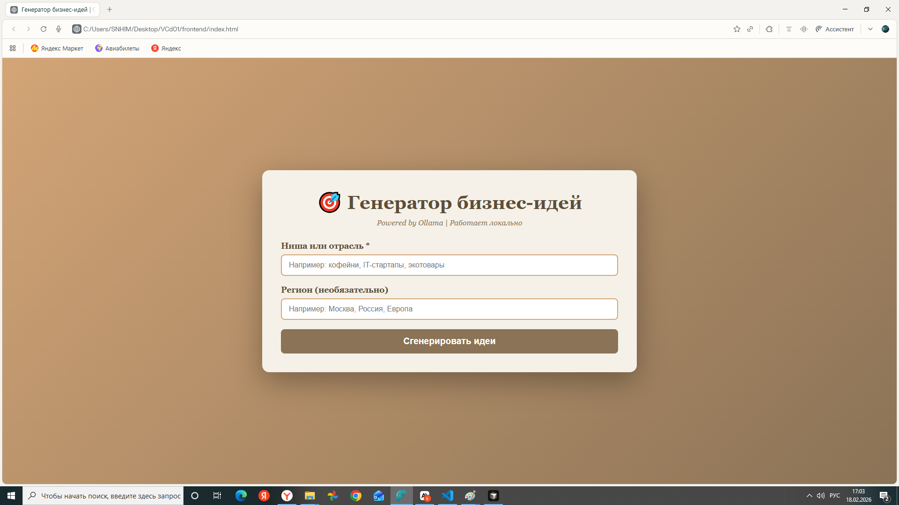
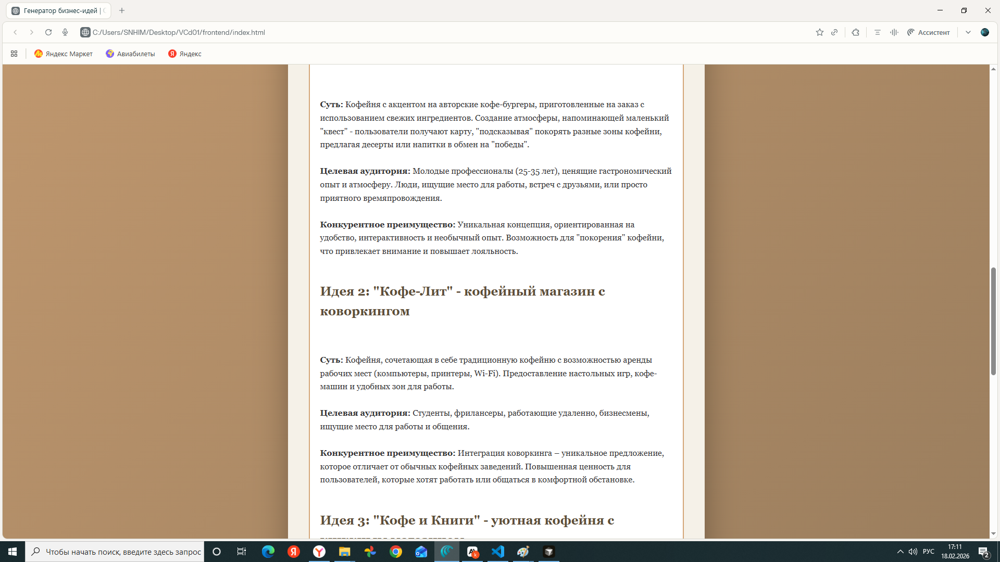

# 🚀 Business Ideas Generator — Локальная версия на Ollama


> 🔒 Полностью локальный AI-агент для исследования рынка и генерации бизнес-идей. Работает без интернета и API-ключей!

Мини-приложение с псевдоагентом для исследования рынка и генерации бизнес-идей, работающее **полностью локально** без доступа к интернету.

---

## 📋 Содержание

- [Особенности](#-особенности)
- [Скриншоты](#-скриншоты)
- [Быстрый старт](#-быстрый-старт-tldr)
- [Требования](#-требования)
- [Установка](#-установка)
- [Запуск](#-запуск)
- [Примеры использования](#-примеры-использования)
- [Выбор модели](#-выбор-модели)
- [Сравнение версий](#-сравнение-локальная-vs-облачная-версия)
- [FAQ](#-faq)
- [Устранение проблем](#-устранение-проблем)
- [Roadmap](#️-roadmap)
- [Contributing](#-участие-в-проекте)
- [Лицензия](#-лицензия)

---

## ✨ Особенности

- 🔒 **100% приватность** — все данные остаются на вашем компьютере
- 💰 **Полностью бесплатно** — никаких API-ключей и подписок
- 🌐 **Работает офлайн** — не требует интернета после установки модели
- ⚡ **Быстрая генерация** — результат за 1-3 минуты (зависит от модели)
- 🎨 **Викторианский дизайн** — уникальный ретро-стиль интерфейса
- 🔄 **Пошаговый процесс** — визуализация каждого этапа исследования
- 📊 **Структурированный отчёт** — 3-5 бизнес-идей с детальным анализом
- 🔧 **Гибкие настройки** — выбор моделей от 1GB до 12GB
- 📝 **Экспорт результатов** — копирование отчёта в Markdown-формате
- 🚀 **Простой запуск** — всего 3 команды для старта

---

## 📸 Скриншоты

### Главная страница с викторианским дизайном

*Элегантный интерфейс в стиле викторианской эпохи с формой ввода ниши*

### Процесс генерации идей

*Визуализация пошагового процесса: сбор данных, анализ конкурентов, выявление возможностей*

### Финальный отчёт с бизнес-идеями

*Структурированный отчёт с 3-5 бизнес-идеями, целевой аудиторией и рисками*

---

## ⚡ Быстрый старт (TL;DR)

```bash
# 1. Установите Ollama
# Скачайте с https://ollama.com/ и установите

# 2. Скачайте модель (выберите одну)
ollama run gemma3:1b        # Быстрая, 1GB RAM
# или
ollama run deepseek-r1:8b   # Точная, 8GB RAM

# 3. Настройте Ollama для сетевого доступа
# Трей → Правый клик на Ollama → Settings → 
# ✅ "Expose Ollama to the network"

# 4. Клонируйте репозиторий
git clone https://github.com/ваш-username/business-ideas-generator-ollama.git
cd business-ideas-generator-ollama

# 5. Установите зависимости
pip install -r backend/requirements.txt

# 6. Запустите backend
python -m uvicorn backend.main:app --reload

# 7. Откройте frontend/index.html в браузере
# Готово! 🎉
```

---

## 📦 Требования

### Системные требования

| Компонент | Минимум | Рекомендуется |
|-----------|---------|---------------|
| **Python** | 3.11+ | 3.14+ |
| **RAM** | 4GB | 8GB+ |
| **Диск** | 5GB | 10GB+ |
| **ОС** | Windows 10+, macOS 12+, Linux | - |

### Программное обеспечение

- ✅ **Ollama** — установлена и запущена локально
- ✅ **Python 3.11+** — для backend
- ✅ **Современный браузер** — для frontend (Chrome, Firefox, Safari)

### Модели Ollama

Минимум одна из моделей (установится при первом запуске):
- `gemma3:1b` — лёгкая модель (~1GB)
- `gemma3:7b` — средняя модель (~4GB) 
- `deepseek-r1:8b` — точная модель (~5GB)
- `gemma3:12b` — мощная модель (~7GB)

---

## 🔧 Установка

### Шаг 1: Установка Ollama

#### Windows
1. Скачайте установщик с [ollama.com](https://ollama.com/)
2. Запустите `OllamaSetup.exe`
3. Следуйте инструкциям установщика

#### macOS
```bash
# Через Homebrew
brew install ollama

# Или скачайте .dmg с ollama.com
```

#### Linux
```bash
curl -fsSL https://ollama.com/install.sh | sh
```

### Шаг 2: Установка модели

Откройте терминал и выполните:

```bash
# Для начала рекомендуем лёгкую модель
ollama run gemma3:1b

# Модель скачается автоматически и запустится
# После первого запуска можно закрыть (Ctrl+C)
```

### Шаг 3: Настройка Ollama для сетевого доступа

**⚠️ Важно:** Backend не сможет подключиться без этой настройки!

1. Найдите иконку Ollama в трее (скрытые значки)
2. Правый клик на иконке
3. Settings (Настройки)
4. Поставьте галочку **"Expose Ollama to the network"**
5. Нажмите Save

### Шаг 4: Установка зависимостей Python

```bash
# Убедитесь, что вы в корневой директории проекта
cd business-ideas-generator-ollama

# Установите зависимости
pip install -r backend/requirements.txt
```

**Содержимое `requirements.txt`:**
```
fastapi
uvicorn
requests
pydantic
```

---

## 🚀 Запуск

### Способ 1: Полный запуск (рекомендуется)

#### Терминал 1: Запуск Ollama
```bash
ollama run gemma3:1b
```
☝️ **Не закрывайте этот терминал!** Ollama должна работать постоянно.

#### Терминал 2: Запуск Backend
```bash
# Вариант А: Через uvicorn (рекомендуется)
python -m uvicorn backend.main:app --reload

# Вариант Б: Напрямую
cd backend
python main.py
```

После успешного запуска увидите:
```
INFO:     Uvicorn running on http://127.0.0.1:8000
INFO:     Application startup complete.
```

#### Браузер: Открытие Frontend

**Вариант 1** (через проводник):
1. Перейдите в папку `frontend/`
2. Двойной клик на `index.html`

**Вариант 2** (через адресную строку браузера):
```
file:///полный/путь/к/проекту/frontend/index.html
```

### Способ 2: Фоновый запуск (для продвинутых)

```bash
# Запуск Ollama в фоне (Linux/macOS)
ollama serve &

# Запуск backend в фоне
nohup python -m uvicorn backend.main:app --host 0.0.0.0 --port 8000 &
```

---

## 🧪 Проверка работоспособности

### Тест 1: Проверка здоровья сервера

Откройте в браузере:
```
http://127.0.0.1:8000/health
```

✅ **Успешный ответ:**
```json
{
  "status": "ok",
  "ollama": true
}
```

❌ **Если ollama: false** — Ollama не запущена или не настроена

### Тест 2: Генерация идей через интерфейс

1. Откройте `frontend/index.html`
2. Введите данные:
   - **Ниша:** `кофейни`
   - **Регион:** `Москва`
3. Нажмите **"Сгенерировать идеи"**
4. Дождитесь результата (1-3 минуты)

✅ **Успех:** Видите пошаговый процесс и финальный отчёт

---

## 💡 Примеры использования

### Пример 1: Исследование рынка кофеен

**Входные данные:**
```
Ниша: кофейни
Регион: Москва
```

**Процесс:**
1. ✅ Анализ трендов в кофейной индустрии
2. ✅ Изучение конкурентов в Москве
3. ✅ Выявление болей целевой аудитории
4. ✅ Поиск незанятых ниш
5. ✅ Генерация бизнес-идей

**Результат:** 5 бизнес-идей, включая:
- Кофейня-коворкинг для фрилансеров
- Мобильная кофейня на велосипеде  
- Специализация на альтернативных методах заваривания
- Кофейня с детской зоной для родителей
- Подписочная модель для постоянных клиентов

### Пример 2: EdTech стартап

**Входные данные:**
```
Ниша: онлайн-образование
Регион: СНГ
```

**Результат:**
- Анализ 10+ конкурентов
- Выявление 7 основных болей аудитории
- 5 готовых концепций образовательных платформ
- Оценка рисков и конкурентных преимуществ

### Пример 3: Локальный бизнес

**Входные данные:**
```
Ниша: салоны красоты
Регион: Санкт-Петербург
```

**Получите:**
- Тренды в индустрии красоты 2025
- Карта конкурентов по районам
- Анализ ценового позиционирования
- 3-5 идей для дифференциации

---

## 🎯 Выбор модели

### Сравнение доступных моделей

| Модель | Размер | Скорость | Точность | RAM | Рекомендация |
|--------|--------|----------|----------|-----|--------------|
| **gemma3:1b** | ~1GB | ⚡⚡⚡ Очень быстро | ⭐⭐ Низкая | 2GB | Для тестов |
| **gemma3:7b** | ~4GB | ⚡⚡ Средне | ⭐⭐⭐⭐ Хорошая | 6GB | Оптимальная |
| **deepseek-r1:8b** | ~5GB | ⚡⚡ Средне | ⭐⭐⭐⭐⭐ Отличная | 8GB | **Рекомендуем** |
| **gemma3:12b** | ~7GB | ⚡ Медленно | ⭐⭐⭐⭐⭐ Отличная | 12GB | Для мощных ПК |

### Как изменить модель

Откройте файл `backend/main.py` и измените строку:

```python
# Лёгкая и быстрая модель (по умолчанию)
ollama = OllamaClient(model="gemma3:1b")

# 👇 Замените на одну из этих:

# Более точная модель (рекомендуем!)
ollama = OllamaClient(model="deepseek-r1:8b")

# Средняя модель (баланс)
ollama = OllamaClient(model="gemma3:7b")

# Самая мощная модель
ollama = OllamaClient(model="gemma3:12b")
```

**Перезапустите backend** после изменения.

---

## 🔄 Сравнение: Локальная vs Облачная версия

| Критерий | 🏠 Локальная (Ollama) | ☁️ Облачная (OpenAI API) |
|----------|----------------------|---------------------------|
| **Стоимость** | ✅ Бесплатно | ❌ Платно (~$0.01-0.10 за запрос) |
| **Интернет** | ✅ Не требуется | ❌ Обязателен |
| **Приватность** | ✅ 100% | ⚠️ Данные уходят в API |
| **Скорость** | ⚠️ Зависит от железа | ✅ Стабильно быстро |
| **Качество** | ⚠️ Зависит от модели | ✅ Высокое (GPT-4) |
| **Установка** | ⚠️ Сложнее | ✅ Проще |
| **Лимиты** | ✅ Неограниченно | ❌ Есть квоты |
| **Модели** | 🔧 Настраиваемо | 🔒 Фиксированные |

### 💡 Рекомендации по выбору:

**Используйте локальную версию, если:**
- 🔒 Нужна конфиденциальность данных
- 💰 Хотите избежать ежемесячных платежей
- 🧪 Экспериментируете и обучаетесь
- 🌐 Нет стабильного интернета
- 🔧 Хотите контроль над моделями

**Используйте облачную версию, если:**
- ⚡ Критична скорость и стабильность
- 🎯 Нужно максимальное качество ответов
- 💼 Коммерческое использование
- 👥 Множество пользователей
- 📱 Доступ с разных устройств


---

## ❓ FAQ

<details>
<summary><b>1. Какая модель лучше для начала?</b></summary>

Начните с **`gemma3:1b`** — она быстрая и требует мало памяти (2GB). Если результаты не устраивают, переключитесь на **`deepseek-r1:8b`** для лучшего качества.
</details>

<details>
<summary><b>2. Сколько RAM реально нужно?</b></summary>

**Минимум:**
- 4GB RAM для `gemma3:1b`
- 8GB RAM для `deepseek-r1:8b`

**Рекомендуется:**
- 8GB+ для комфортной работы
- 16GB для крупных моделей (`gemma3:12b`)
</details>

<details>
<summary><b>3. Работает ли на MacBook?</b></summary>

Да! Ollama **отлично работает** на Apple Silicon (M1/M2/M3/M4). Производительность будет даже лучше, чем на Windows благодаря Metal ускорению. Рекомендуем `deepseek-r1:8b` для MacBook Air и выше.
</details>

<details>
<summary><b>4. Безопасно ли вводить конфиденциальные данные?</b></summary>

**Абсолютно безопасно!** Все данные обрабатываются локально на вашем компьютере и никуда не передаются. В отличие от облачных API, ваши бизнес-идеи остаются только у вас.
</details>

<details>
<summary><b>5. Можно ли использовать GPU для ускорения?</b></summary>

Да! Ollama автоматически использует GPU если он доступен:
- **NVIDIA** — через CUDA
- **AMD** — через ROCm (Linux)
- **Apple Silicon** — через Metal

Никаких дополнительных настроек не требуется.
</details>

<details>
<summary><b>6. Почему генерация занимает 2-3 минуты?</b></summary>

Локальные LLM работают медленнее облачных API. Скорость зависит от:
- Модели (1b быстрее, 12b медленнее)
- Процессора/GPU
- Объёма RAM

Для ускорения используйте меньшую модель или обновите железо.
</details>

<details>
<summary><b>7. Нужен ли интернет после установки?</b></summary>

**Нет!** После скачивания модели проект работает полностью офлайн. Интернет нужен только для:
- Первичной установки Ollama
- Скачивания моделей
- Установки Python зависимостей
</details>

<details>
<summary><b>8. Можно ли запустить на слабом ПК/ноутбуке?</b></summary>

Да, но используйте **`gemma3:1b`**:
- Требует всего 2GB RAM
- Работает на любом процессоре (медленнее)
- Качество ниже, но приемлемо для базовых задач
</details>

<details>
<summary><b>9. Как обновить модель до новой версии?</b></summary>

```bash
# Обновление модели
ollama pull gemma3:1b

# Список установленных моделей
ollama list

# Удаление старой модели
ollama rm gemma3:1b
```
</details>

<details>
<summary><b>10. Модель даёт неточные или странные ответы. Что делать?</b></summary>

**Решения:**
1. Переключитесь на более мощную модель (`deepseek-r1:8b`)
2. Уточните запрос — добавьте больше контекста
3. Попробуйте перефразировать вопрос
4. Убедитесь, что модель полностью загружена (ollama list)
</details>

---

## 🐛 Устранение проблем

### ❌ Ошибка: "Не удалось подключиться к Ollama"

**Причина:** Backend не может достучаться до Ollama API.

**Решение:**

1. **Проверьте, запущена ли Ollama:**
   ```bash
   ollama list
   ```
   Должен показать список моделей.

2. **Включите сетевой доступ:**
   - Трей → Ollama → Settings
   - ✅ "Expose Ollama to the network"
   - Save

3. **Перезапустите Ollama:**
   - Закройте из трея
   - Запустите заново: `ollama run gemma3:1b`

4. **Проверьте порт 11434:**
   ```bash
   curl http://localhost:11434
   ```
   Должен вернуть: `Ollama is running`

---

### ⏱️ Ошибка: "Ollama не ответила вовремя (timeout)"

**Причина:** Модель слишком большая для вашего железа.

**Решение:**

1. **Используйте более лёгкую модель:**
   ```python
   # В backend/main.py
   ollama = OllamaClient(model="gemma3:1b")
   ```

2. **Увеличьте timeout:**
   ```python
   # В backend/ollama_client.py
   timeout=600  # 10 минут вместо 5
   ```

3. **Освободите RAM:**
   - Закройте ненужные программы
   - Перезагрузите компьютер

---

### 🎯 Модель даёт неточные/неструктурированные ответы

**Причина:** Модель слишком лёгкая (`gemma3:1b`) или промпты требуют доработки.

**Решение:**

1. **Установите более мощную модель:**
   ```bash
   ollama run deepseek-r1:8b
   ```

2. **Измените модель в коде:**
   ```python
   # backend/main.py
   ollama = OllamaClient(model="deepseek-r1:8b")
   ```

3. **Уточните запрос:**
   - Добавьте больше деталей о нише
   - Укажите конкретный регион/город
   - Опишите целевую аудиторию

---

### 🌐 Frontend не открывается / белая страница

**Решение:**

1. **Проверьте пути к файлам:**
   ```html
   <!-- В index.html должны быть правильные пути -->
   <link rel="stylesheet" href="style.css">
   <script src="app.js"></script>
   ```

2. **Откройте консоль браузера:**
   - F12 (Chrome/Firefox)
   - Посмотрите на ошибки JavaScript

3. **Проверьте CORS:**
   - Некоторые браузеры блокируют локальные файлы
   - Используйте расширение "Allow CORS"

---

### 🔧 Backend не запускается

**Ошибка:** `ModuleNotFoundError: No module named 'fastapi'`

**Решение:**
```bash
pip install -r backend/requirements.txt
```

**Ошибка:** `Address already in use`

**Решение:**
```bash
# Найти процесс на порту 8000
lsof -i :8000  # macOS/Linux
netstat -ano | findstr :8000  # Windows

# Убить процесс
kill -9 PID  # macOS/Linux
taskkill /PID PID /F  # Windows

# Или используйте другой порт
uvicorn backend.main:app --port 8001
```

---

### 🍎 Проблемы на macOS

**Ошибка:** `xcrun: error: invalid active developer path`

**Решение:**
```bash
xcode-select --install
```

**Ошибка:** Ollama не запускается

**Решение:**
```bash
# Переустановите через Homebrew
brew reinstall ollama

# Или используйте официальный .dmg
```

---

## 🗺️ Roadmap

### ✅ Версия 1.0 (Текущая)
- [x] Поддержка Ollama
- [x] Викторианский UI
- [x] Пошаговая генерация
- [x] Экспорт в Markdown
- [x] Выбор моделей

### 🚧 Версия 1.1 (В разработке)
- [ ] Docker-контейнер для backend
- [ ] Выбор модели через интерфейс
- [ ] Темная/светлая тема
- [ ] Сохранение истории локально
- [ ] Прогресс-бар генерации

### 📅 Версия 1.2 (Планируется)
- [ ] Экспорт в PDF/DOCX
- [ ] Интеграция веб-поиска (опционально)
- [ ] Мультиязычность (EN, RU, ES, ZH)
- [ ] Сравнение нескольких ниш
- [ ] Графики и визуализация данных

### 🔮 Версия 2.0 (Будущее)
- [ ] Telegram-бот интерфейс
- [ ] Веб-версия с аутентификацией
- [ ] AI-визуализация идей (диаграммы, майндмэпы)
- [ ] Расширенная аналитика рынка
- [ ] Интеграция с базами данных компаний
- [ ] Collaborative mode (для команд)

---


## 📄 Лицензия

Этот проект распространяется под **лицензией MIT**. См. файл [LICENSE](LICENSE) для деталей.

**Вкратце:** вы можете свободно использовать, изменять и распространять этот код, даже в коммерческих целях, при условии сохранения копирайта.

---

## 🌟 Благодарности

- **[Ollama](https://ollama.com/)** — за потрясающий инструмент для локальных LLM
- **[FastAPI](https://fastapi.tiangolo.com/)** — за простой и быстрый фреймворк
- **Gemma Team** — за качественные открытые модели
- **DeepSeek** — за мощную модель reasoning
- **Сообщество** — за feedback и предложения

---

## 📞 Контакты и поддержка

- 📧 **Email:** kiboto30@gmail.com


---

## ☕ Поддержать проект

Если проект оказался полезным, можете поддержать разработку:

Даже ⭐ **звезда на GitHub** очень мотивирует продолжать развитие!

---

<div align="center">

**Сделано с ❤️ в России**

⭐ Поставьте звезду, если проект был полезен!

[](https://star-history.com/#ваш-username/business-ideas-generator-ollama&Date)

</div>

